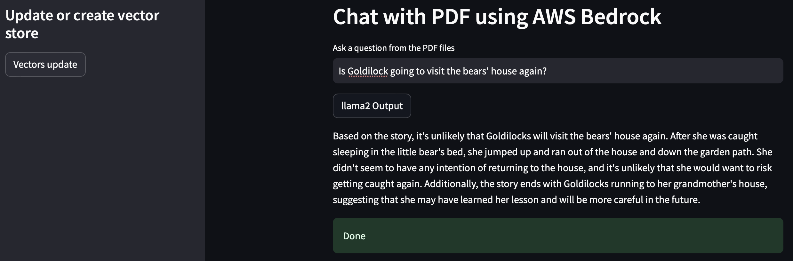

# Question Answering from External Knowledge Base with RAG

## Description
I created an end-to-end RAG App using AWS bedrock, Langchain and streamlit. 
In the example, I used Goldilocks and the three bears as knowledge base 
to create the vector store. Then I can ask the LLM App questions related to 
the story.



## Requirement
Run ```pip install -r requirements.txt``` to install required packages.

## Usage

Try ```streamlit run src/main.py -- --config config.json``` to run code.
